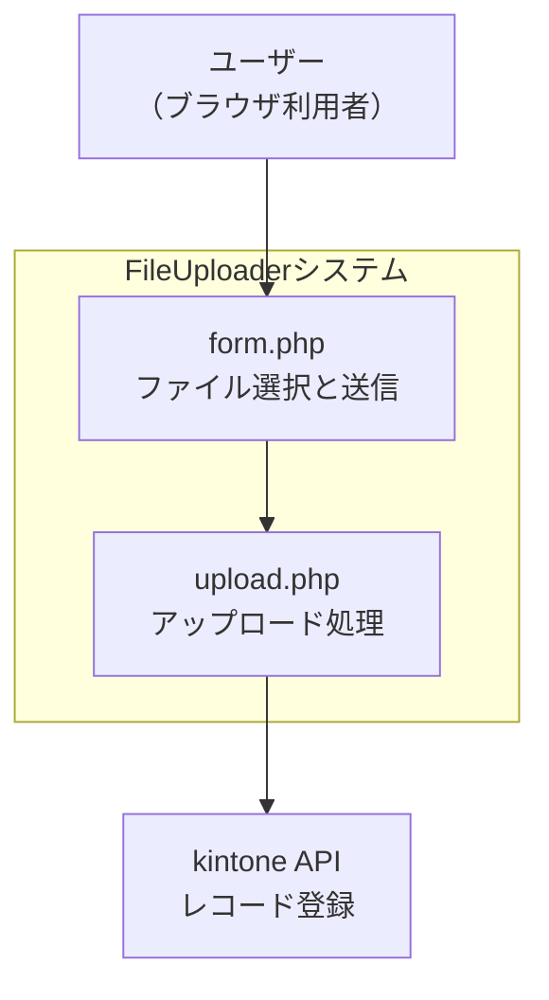
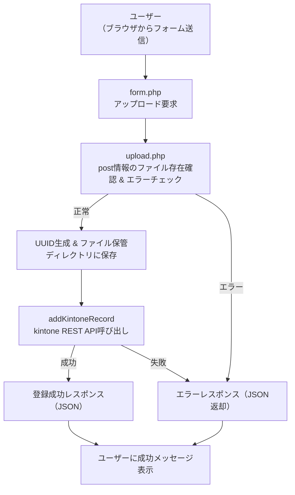
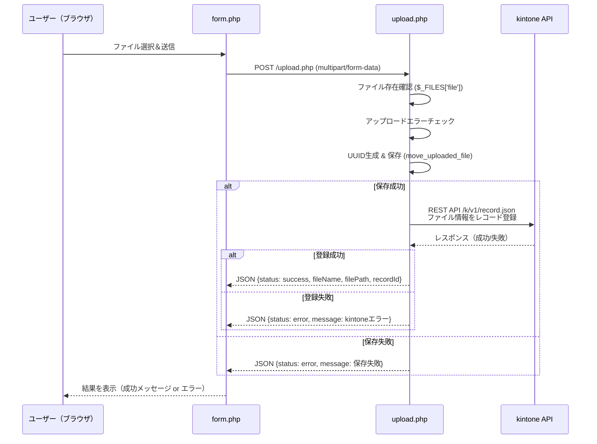
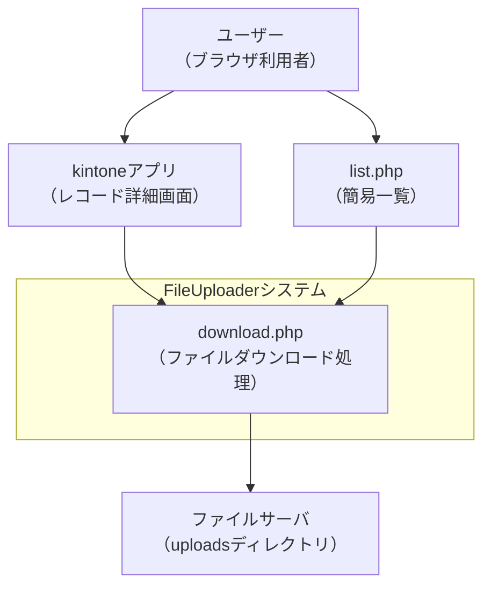
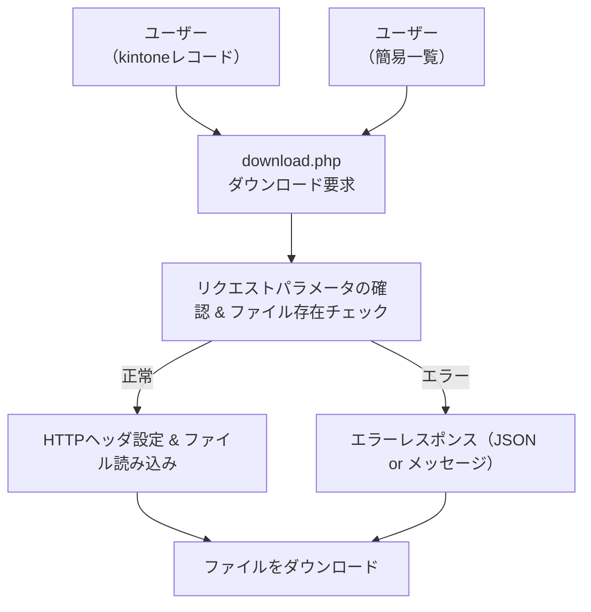
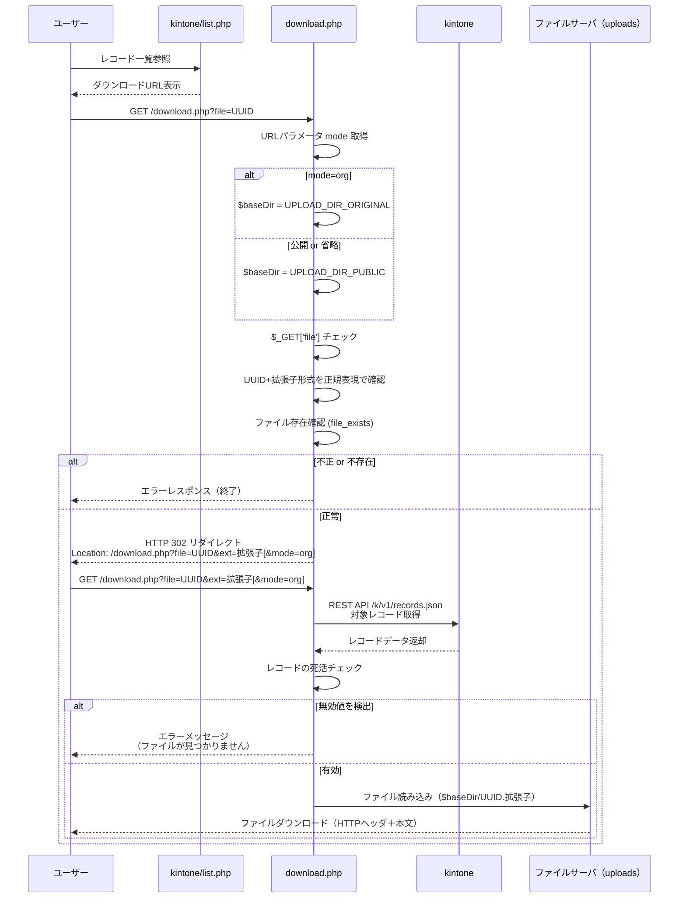

設計資料
=========

## formからのアップロード

### ユースケース図

```mermaid
flowchart TD
    %% アクター
    USR[ユーザー<br>（ブラウザ利用者）]

    %% システム
    subgraph S[FileUploaderシステム]
        FRM[form.php<br>ファイル選択と送信]
        UP[upload.php<br>アップロード処理]
    end

    %% 外部システム
    KNTN[kintone API<br>レコード登録]

    %% 矢印
    USR --> FRM
    FRM --> UP
    UP --> KNTN
```

### フローチャート

```mermaid
flowchart TD
    USR[ユーザー<br>（ブラウザからフォーム送信）] --> FRM[form.php<br>アップロード要求]
    FRM --> UP[upload.php<br>post情報のファイル存在確認 & エラーチェック]
    UP -->|正常| UP_UUID[UUID生成 & ファイル保管ディレクトリに保存]
    UP -->|エラー| UP_ERR[エラーレスポンス（JSON返却）]
    UP_UUID --> ADD_KNTN[addKintoneRecord <br>kintone REST API呼び出し]
    ADD_KNTN -->|成功| UP_SUC[登録成功レスポンス（JSON）]
    ADD_KNTN -->|失敗| UP_ERR[エラーレスポンス（JSON返却）]
    UP_SUC --> G[ユーザーに成功メッセージ表示]
    UP_ERR --> G
```

### シーケンス図

```mermaid
sequenceDiagram
    participant User as ユーザー（ブラウザ）
    participant Form as form.php
    participant Upload as upload.php
    participant Kintone as kintone API

    %% ユーザー操作
    User ->> Form: ファイル選択＆送信
    Form ->> Upload: POST /upload.php (multipart/form-data)

    %% サーバー側処理
    Upload ->> Upload: ファイル存在確認 ($_FILES['file'])
    Upload ->> Upload: アップロードエラーチェック
    Upload ->> Upload: UUID生成 & 保存 (move_uploaded_file)

    alt 保存成功
        Upload ->> Kintone: REST API /k/v1/record.json<br>ファイル情報をレコード登録
        Kintone -->> Upload: レスポンス（成功/失敗）

        alt 登録成功
            Upload -->> Form: JSON {status: success, fileName, filePath, recordId}
        else 登録失敗
            Upload -->> Form: JSON {status: error, message: kintoneエラー}
        end
    else 保存失敗
        Upload -->> Form: JSON {status: error, message: 保存失敗}
    end

    %% ユーザー側への応答
    Form -->> User: 結果を表示（成功メッセージ or エラー）
```

## ファイルダウンロード
### ユースケース図

```mermaid
flowchart TD
    %% アクター
    USR[ユーザー<br>（ブラウザ利用者）]

    %% 外部システム（起点）
    KNTN[kintoneアプリ<br>（レコード詳細画面）]
    LST[list.php<br>（簡易一覧）]

    %% システム
    subgraph S[FileUploaderシステム]
        DL[download.php<br>（ファイルダウンロード処理）]
    end

    %% 外部システム（ファイル格納）
    FS[ファイルサーバ<br>（uploadsディレクトリ）]

    %% 矢印
    USR --> KNTN
    USR --> LST
    KNTN --> DL
    LST --> DL
    DL --> FS

```

### フローチャート

```mermaid
flowchart TD
    KNTN[ユーザー<br>（kintoneレコード）] --> DL[download.php<br>ダウンロード要求]
    LST[ユーザー<br>（簡易一覧）] --> DL[download.php<br>ダウンロード要求]
    DL --> UP[リクエストパラメータの確認 & ファイル存在チェック]
    UP -->|正常| UP_UUID[HTTPヘッダ設定 & ファイル読み込み]
    UP -->|エラー| UP_ERR[エラーレスポンス（JSON or メッセージ）]
    UP_UUID --> ADD_KNTN[ファイルをダウンロード]
    UP_ERR --> ADD_KNTN

```

### シーケンス図

```mermaid
sequenceDiagram
    participant User as ユーザー
    participant Kntn as kintone/list.php
    participant DL as download.php
    participant kintone as kintone
    participant FS as ファイルサーバ（uploads）

    User ->> Kntn: レコード一覧参照
    Kntn -->> User: ダウンロードURL表示
    User ->> DL: GET /download.php?file=UUID

    DL ->> DL: URLパラメータ mode 取得
    alt mode=org
        DL ->> DL: $baseDir = UPLOAD_DIR_ORIGINAL
    else 公開 or 省略
        DL ->> DL: $baseDir = UPLOAD_DIR_PUBLIC
    end


    DL ->> DL: $_GET['file'] チェック
    DL ->> DL: UUID+拡張子形式を正規表現で確認
    DL ->> DL: ファイル存在確認 (file_exists)

    alt 不正 or 不存在
        DL -->> User: エラーレスポンス（終了）
    else 正常
        DL -->> User: HTTP 302 リダイレクト<br>Location: /download.php?file=UUID&ext=拡張子[&mode=org]
        User ->> DL: GET /download.php?file=UUID&ext=拡張子[&mode=org]

        DL ->> kintone: REST API  /k/v1/records.json<br>対象レコード取得
        kintone -->> DL: レコードデータ返却

        DL ->> DL: レコードの死活チェック
        alt 無効値を検出
            DL -->> User: エラーメッセージ<br>（ファイルが見つかりません）
        else 有効
            DL ->> FS: ファイル読み込み（$baseDir/UUID.拡張子）
            FS -->> User: ファイルダウンロード（HTTPヘッダ＋本文）
        end
    end

```