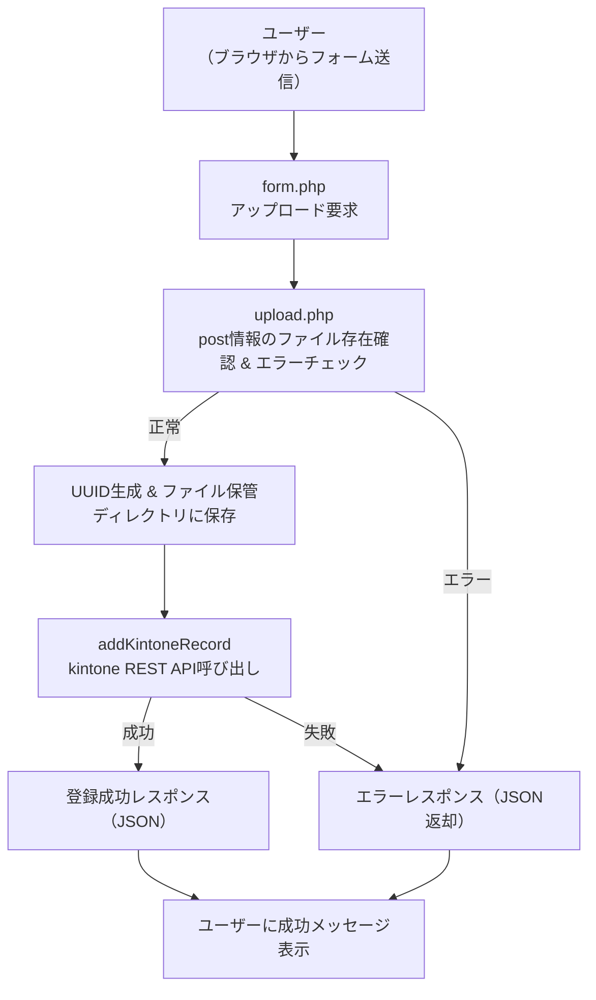
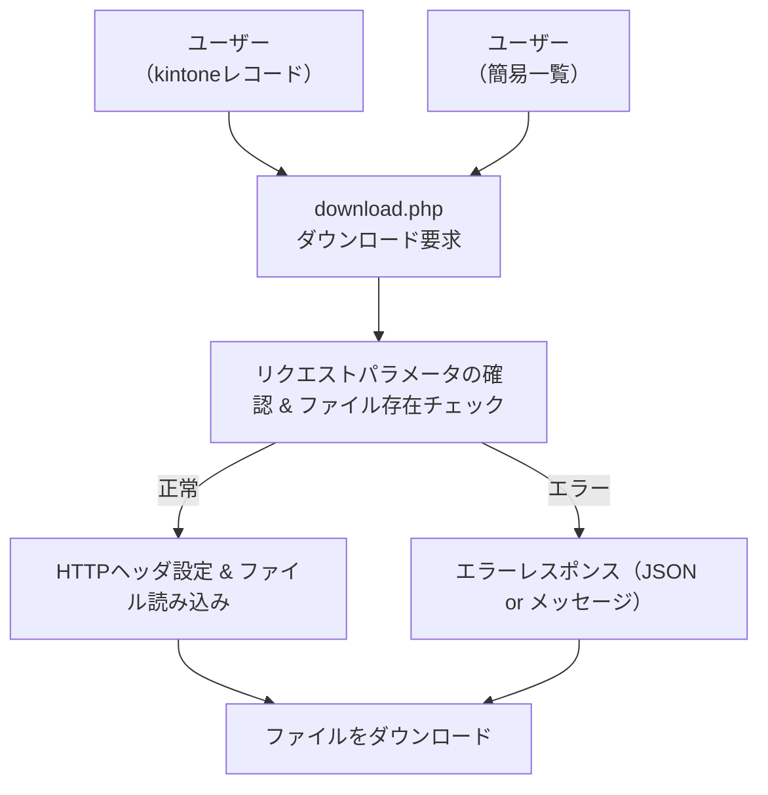

フローチャート
===============

## formからのアップロード

```mermaid
flowchart TD
    USR[ユーザー<br>（ブラウザからフォーム送信）] --> FRM[form.php<br>アップロード要求]
    FRM --> UP[upload.php<br>post情報のファイル存在確認 & エラーチェック]
    UP -->|正常| UP_UUID[UUID生成 & ファイル保管ディレクトリに保存]
    UP -->|エラー| UP_ERR[エラーレスポンス（JSON返却）]
    UP_UUID --> ADD_KNTN[addKintoneRecord <br>kintone REST API呼び出し]
    ADD_KNTN -->|成功| UP_SUC[登録成功レスポンス（JSON）]
    ADD_KNTN -->|失敗| UP_ERR[エラーレスポンス（JSON返却）]
    UP_SUC --> G[ユーザーに成功メッセージ表示]
    UP_ERR --> G
```

## ファイルダウンロード

```mermaid
flowchart TD
    KNTN[ユーザー<br>（kintoneレコード）] --> DL[download.php<br>ダウンロード要求]
    LST[ユーザー<br>（簡易一覧）] --> DL[download.php<br>ダウンロード要求]
    DL --> UP[リクエストパラメータの確認 & ファイル存在チェック]
    UP -->|正常| UP_UUID[HTTPヘッダ設定 & ファイル読み込み]
    UP -->|エラー| UP_ERR[エラーレスポンス（JSON or メッセージ）]
    UP_UUID --> ADD_KNTN[ファイルをダウンロード]
    UP_ERR --> ADD_KNTN

```
