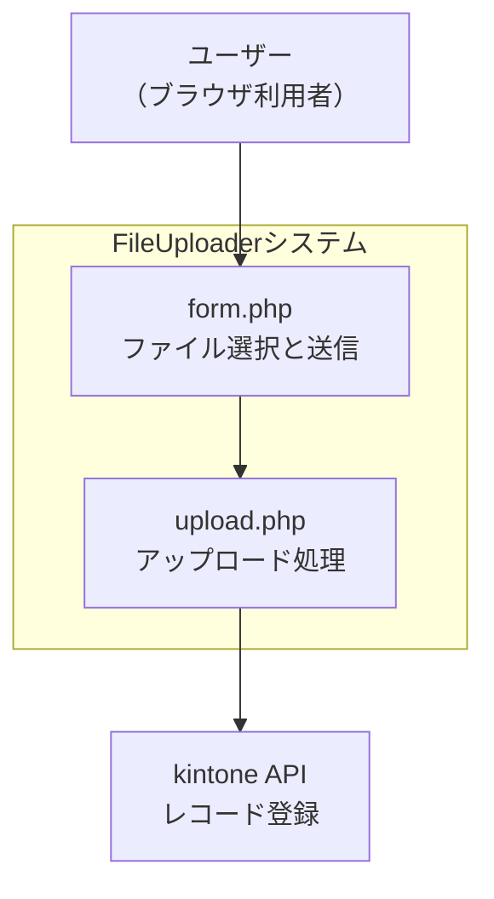
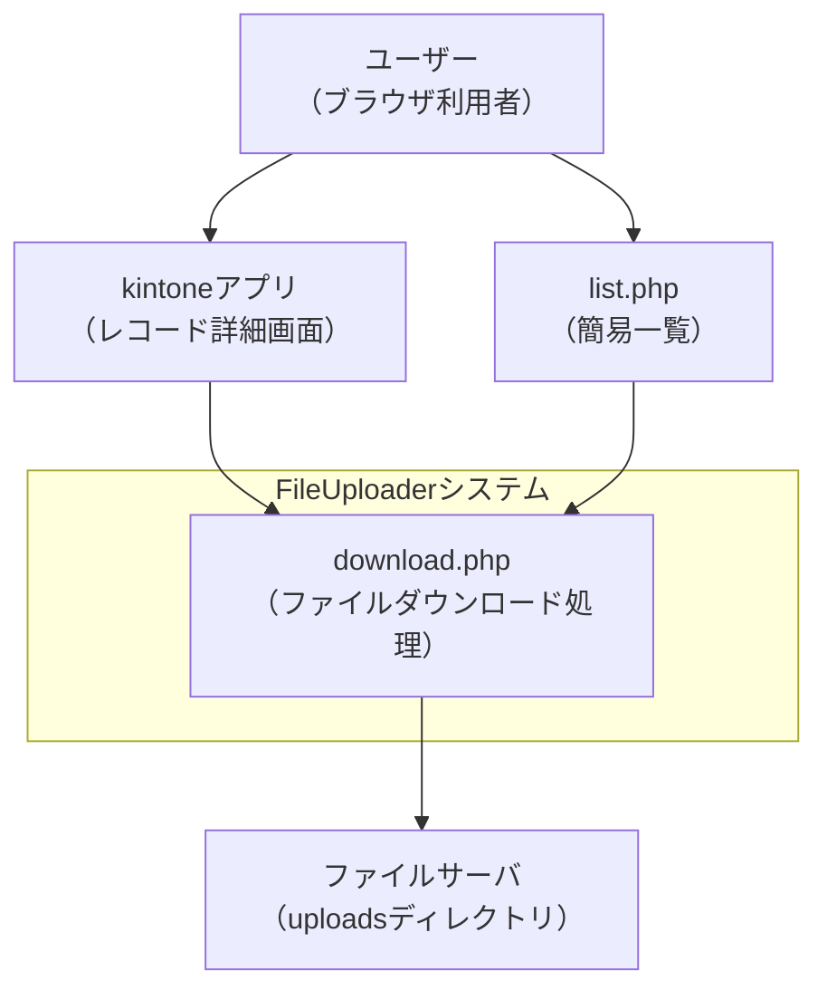

ユースケース図
===============

## formからのアップロード

```mermaid
flowchart TD
    %% アクター
    USR[ユーザー<br>（ブラウザ利用者）]

    %% システム
    subgraph S[FileUploaderシステム]
        FRM[form.php<br>ファイル選択と送信]
        UP[upload.php<br>アップロード処理]
    end

    %% 外部システム
    KNTN[kintone API<br>レコード登録]

    %% 矢印
    USR --> FRM
    FRM --> UP
    UP --> KNTN
```

## ファイルダウンロード

```mermaid
flowchart TD
    %% アクター
    USR[ユーザー<br>（ブラウザ利用者）]

    %% 外部システム（起点）
    KNTN[kintoneアプリ<br>（レコード詳細画面）]
    LST[list.php<br>（簡易一覧）]

    %% システム
    subgraph S[FileUploaderシステム]
        DL[download.php<br>（ファイルダウンロード処理）]
    end

    %% 外部システム（ファイル格納）
    FS[ファイルサーバ<br>（uploadsディレクトリ）]

    %% 矢印
    USR --> KNTN
    USR --> LST
    KNTN --> DL
    LST --> DL
    DL --> FS

```

